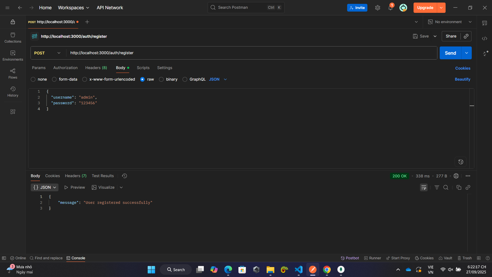
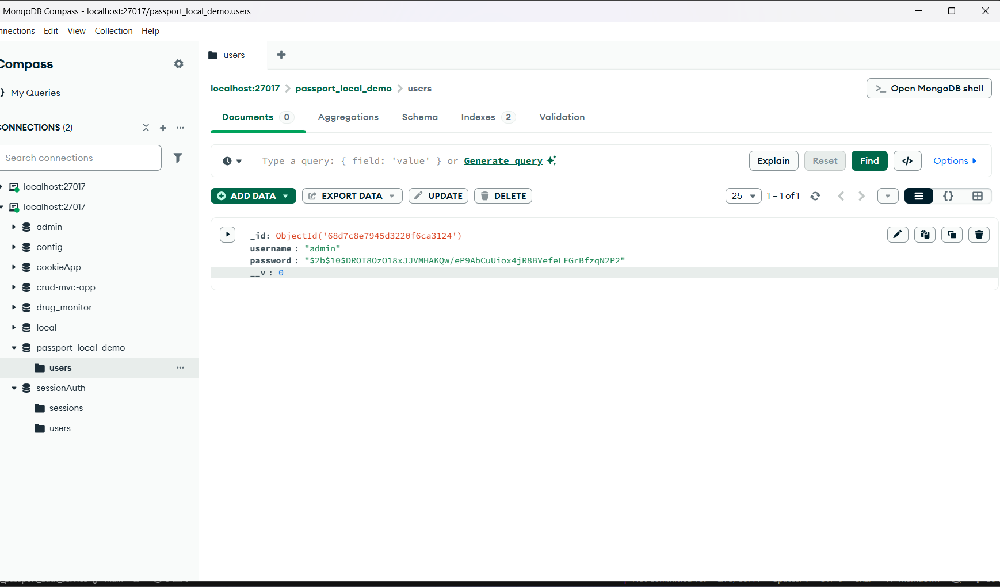
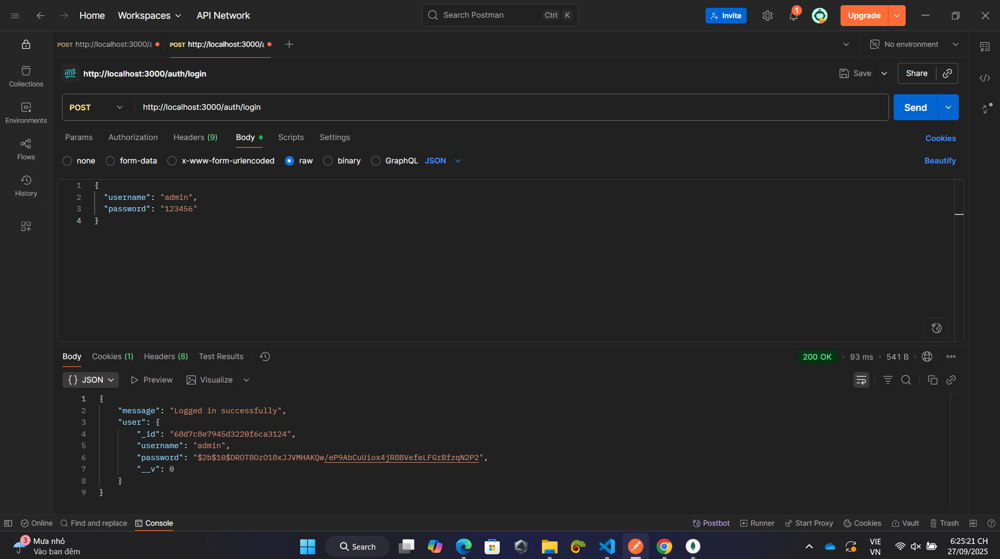
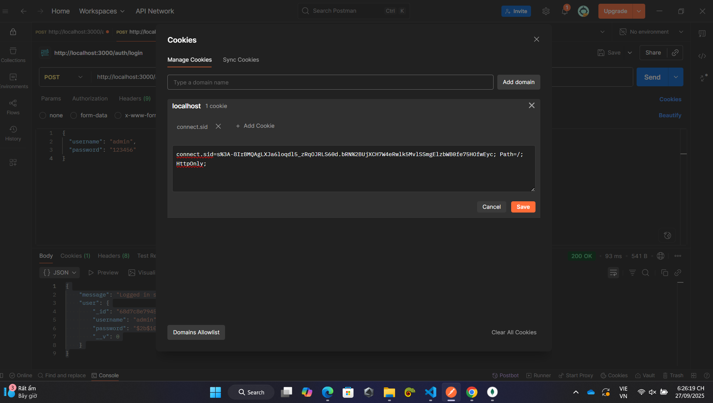
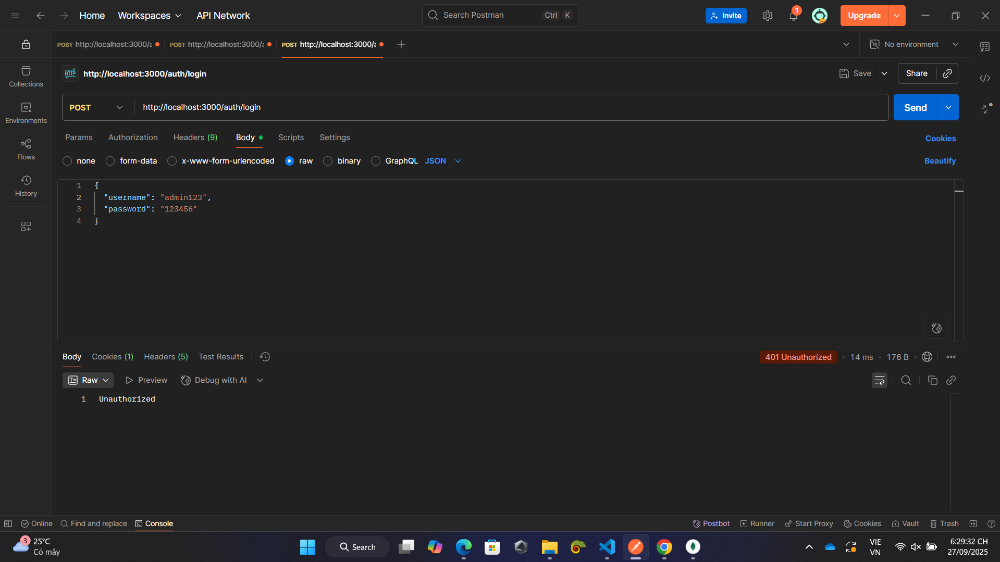
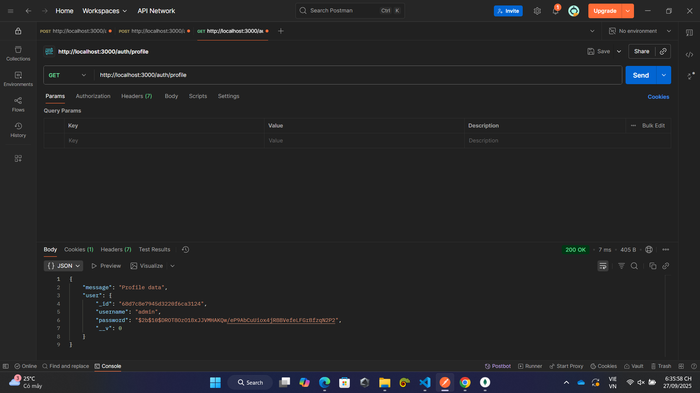
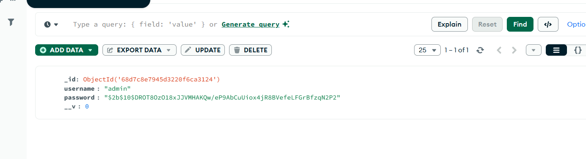
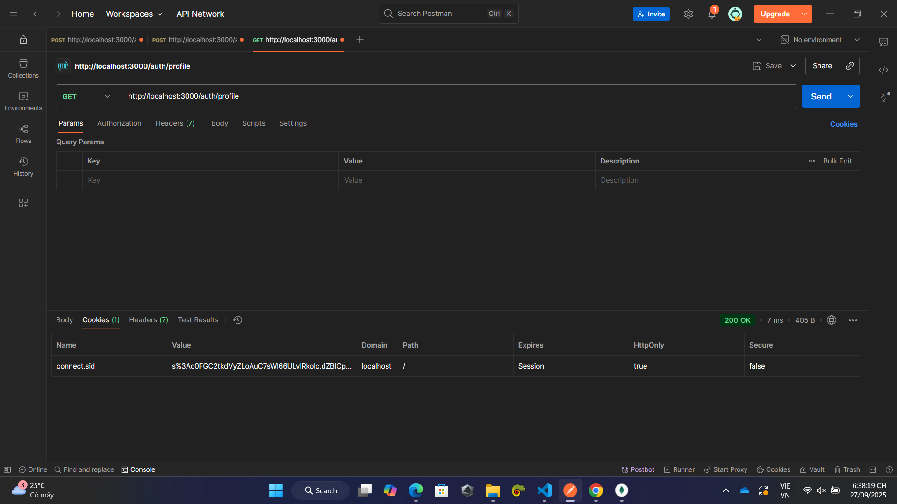
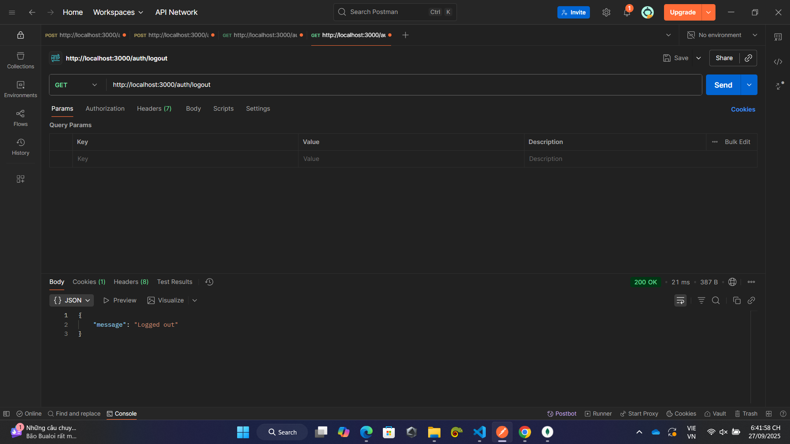
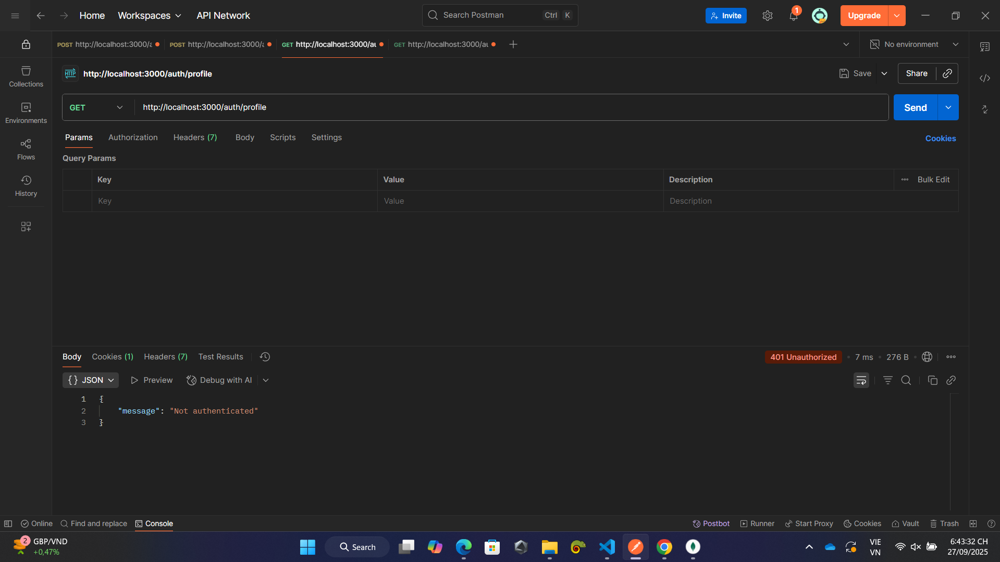

1. Register
- method = POST
- URL: http://localhost:3000/auth/register
- đăng ký thành công

- Hiển thị người dùng trong database

2. Login
Method = POST 
URL: http://localhost:3000/auth/login
-Login thành công kết quả trả về 
{
    "message": "Logged in successfully",
    "user": {
        "_id": "68d7c8e7945d3220f6ca3124",
        "username": "admin",
        "password": "$2b$10$DROT8OzO18xJJVMHAKQw/eP9AbCuUiox4jR8BVefeLFGrBfzqN2P2",
        "__v": 0
    }
}

-Sau khi login thành công postman trả về session cookie được tự sinh ra với thư viện passport-local

3. Login thất bại
Trả về thông báo "Unauthorized"

4. Truy cập route bảo vệ /auth/profile khi đã login
Method = GET 
URL: http://localhost:3000/auth/profile

truy cập thành công và trả về kết quả gồm usernam và password đã được mã hóa

password được mã hóa giông với password được lưu trong database

có cookie giống với cookie khi login được trả về

5. Logout
Method = GET 
URL: http://localhost:3000/auth/logout

Logout thành công và trả về thông báo 

6. Truy cập route bảo vệ /auth/profile khi đã logout
Method = GET 
URL: http://localhost:3000/auth/profile

Không xem được thông tin 

